# SmokeStack Society

Welcome to the Readme file for TODO, a multi-functional online to do app using HTML, CSS & JavaScript.

**A note to the assessors:** *As per recommendation of my mentor I want to mention that I built the JavaScript part of this app in a previous repository to first check whether the project was feasible with my current skill level. With the development of **this**, final project, some code from that previous built was then copied and pasted into this one. I mention that in case the short time frame between commits of (especially) the JavaScript part of this projects raise any red flags.*

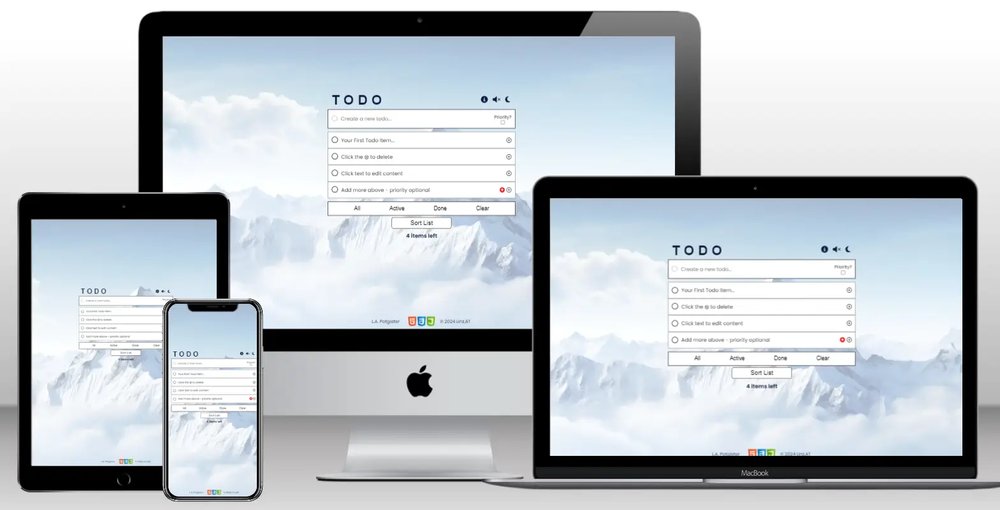

**Link to Live Site: https://leonp84.github.io/code-institute-project-2/**
 
 

## Table of Contents

… TOC Here …

## Overview

TODO is a simple, but multifunctional to do web-based application that allows users to create a simple to do list that is fully editable, sortable, and can be filtered according to task status. The app incorporates a visually appealing design that is minimalistic and has built in light/dark functionality which the user can toggle. Optional sound effects and a help toggle are also available.

The app is fully responsive across all screen sizes, with break points for layout adjustment at 375px, 530px & 769px. The app looks most visually appealing in cell phone and tablet (portrait) format.

## UX

### User Stories

The sentences below outline possible motivations of *potential users* visiting the site. Goals of myself as site administrator is also added.

#### User

> Potential User: *A busy professional* / "I need a no-fuss tool for managing my daily tasks. A tool with simple functionality that can be understood and used straight away without training or reading documentation."

> Potential User: *A parent* / "I want to set daily tasks as reminders of activities involving my spouse or children. I need something that isn’t complicated or tricky to use.”

> Potential User: *A Freelancer* / "I want a tool that allows me to not only set goals, but prioritise certain goals above others, and make it visually obvious which these prioritised goals are."

> Potential User: *A Remote Worker* / "Working from home, I have many items to keep track of, and need a tool that can automatically sort my tasks, based on status, through the click of a button."

#### Site Administrator

> As the site administrator, I want to help visitors with managing their daily tasks in a intuitive and distraction free environment.

> As the site administrator, I want visitors to increase their productivity by incorporating habits of daily planning and scheduling into their workflow.

> As the site administrator, I want users to be interested in other potential (paid) features the app might introduce in the future.

> As the site administrator, I want to create a product that identifies me - in the eyes of users - as a trustworthy site/app developer that has users best interest in mind.

### Site Concept

As a not-for-profit endeavour, I wanted the TODO online web app to serve visitors by providing basic a productivity tool to boost efficiency without unnecessary extras. The User experience had to therefore fulfil the following goals:

1. Be visually simple and minimalistic – essentially distraction-free.

2. Provide appealing, but unobtrusive visual design that makes the app a pleasure to use.

3. Provide clear and unambiguous information about which interactive elements of the app provide which functionality.

4. Provide easy-to-use functionality like sorting, filtering, reordering and clearing items from the to do list.

5. Provide an optional information box with a short motivational text on the value of a to do list.

### Wireframing

After the site concept was finalised, time was taken to create a wireframe mock-up of the app. The app consists of a single landing page with hidden visual elements (an information box) that the user can toggle. Wireframing was done with [Balsamiq](https://balsamiq.com/) software.

#### Desktop

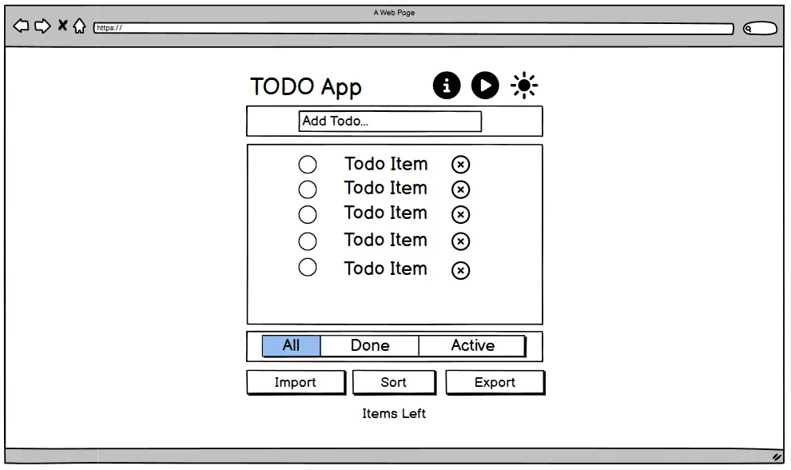

#### Mobile

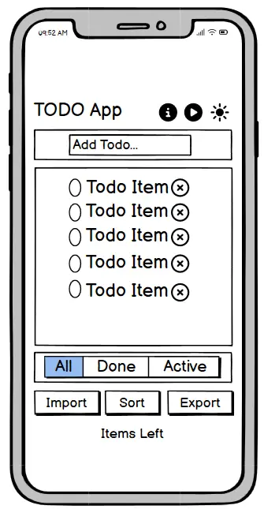

### Site Design

To aid in providing a distraction free experience for visitors, a colour palette was used to keep the design consistent. The Colour palette is shown below, for both the dark and light modes of the app. Most of the app pictures that follow in the rest of this document were taken with dark theme being activated.

*Site Colour Palette Light Mode*
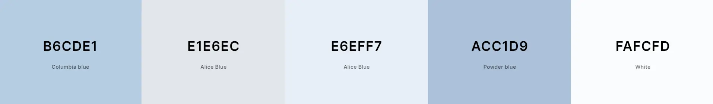

*Site Colour Palette Dark Mode*
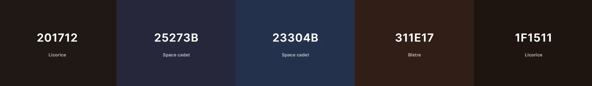

## Features

The site consists of a single landing page and the specific features of the to do app itself is discussed in detail below.

### Existing Features

#### Site Logo

In keeping with the app’s minimalistic design, the site logo simply consists of the letters “T O D O” written out in a large Roboto Font.

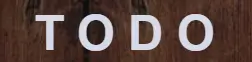

#### Header

With the logo positioned left, the right-hand side of the header includes three buttons: (1) An information box activation toggle, (2) A sound effects toggle and, (3) A dark/light theme toggle. The Header is fully responsive, and the heading font colours adjust with the rest of the site when the visual theme is changed by the user.

The two right most buttons dynamically update when clicked, to indicate to the user that a feature has been activated/deactivated. 

*Site Header Button Not Activated* 
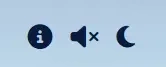

*Site Header Button  Activated* 
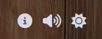

With the sound toggle on, five sound effects are played – depending on the browser and user environment - when users perform the following actions (These functionalities are explained in more detail below): 

1. Add new items

2. Check an item as completed

3. Click on **‘All’**, **‘Active’** or **‘Done’**

4. Click on **‘Clear’**

5. Click on **‘Sort List’**

*Screenshot of Dark Theme activated:*
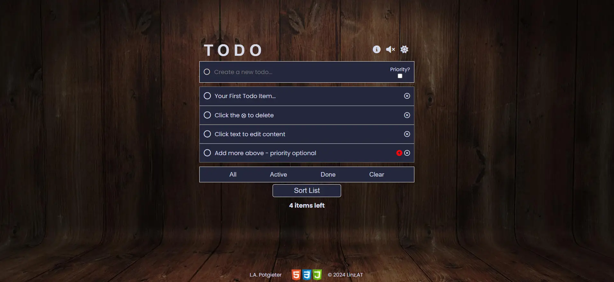

*Screenshot of Light Theme activated:*
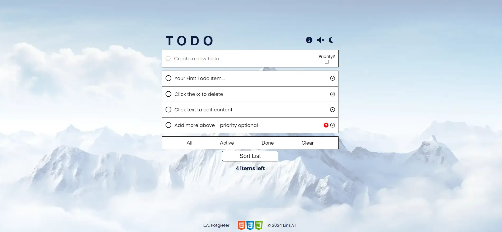

#### Add New User Item

Below the header, the main user input is presented. Here the user can enter a new to do item which will be added to their main list. Next to the text field an additional “Priority?” checkbox is provided which users can tick to assign the task with additional priority (which is then indicated in the list display).

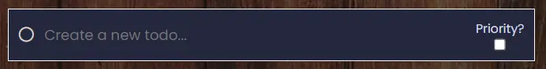

*Features of the user input field:*

1. Accepts **‘Enter’** as valid form submission.

2. Accepts the click of the Priority button also as valid form submission (only if valid text is present in the text field).

3. Does **not** accept black spaces or tabs as valid input.

4. Does **not** accept text that equal that of an item already in the list, to avoid duplicate items. When a duplicate item is entered, the user is warned via a Browser alert.

5. After each iteration where the new list is displayed (or other features of the app engaged in) focus is placed back on the user input field, and the field is emptied of any previous text. This avoids the user needing to constantly re-click on the text box to enter items.

#### Main List Display

Each task is listed in the order they were entered, with priority tasks additionally having a small red arrow next to them. 

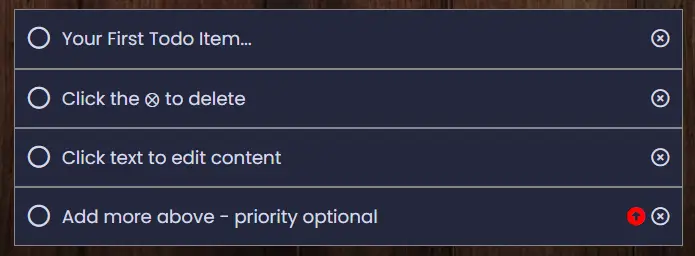

*Features of this section:*

1. Once a task is finished, users can check the **circle next to it** and the visual display of the task updates. The cricle (checkbox) now remains checked, and the text is displayed with the **line-through text** decoration to indicate the task is done. Items can then again be unchecked, if the user so desires.

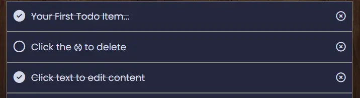

2. Each task can be clicked on, and the text automatically turns into an input field, with the current text now editable. Users can change the text and press ‘Enter’ to save the new wording. The edited items remain in place and is subject to the same validation process as regular new items.

3. Users can completely remove tasks from the list by clicking the ‘X’ to the right of each displayed item.

4. On larger screens, the item text and remove buttons includes a hover effect for visual feedback.

#### User Controls

Under the displayed list, a section with user controls is presented. 

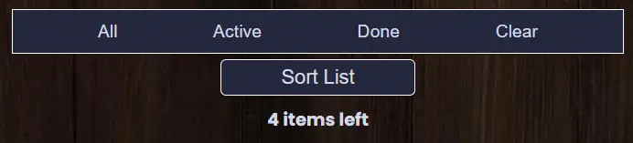

*Features of this section:*

1. Clicking **‘All’** displays the entire list, irrespective of items status.

2. Clicking **'Active’** displays items that have not been checked (and has a line-through text).

3. Clicking **‘Done’** displays items that the user have checked as completed.

4. Clicking **‘Clear’** completely removes all checked items from the list with only active tasks remaining. The user can use this button to minify the list if desired.

5. Clicking **‘Sort’** will sort the list in place, with priority items placed at the top, and checked (completed) items at the bottom (Image Below).

6. The number of items left on the to do list are displayed below the sort button. This number dynamically updates as users check/uncheck an item or adds new ones to the ist.

7. On larger screens, the user control buttons include a hover effect for visual feedback.

 

*Main To do list after the user has clicked on the ‘Sort’ button* 
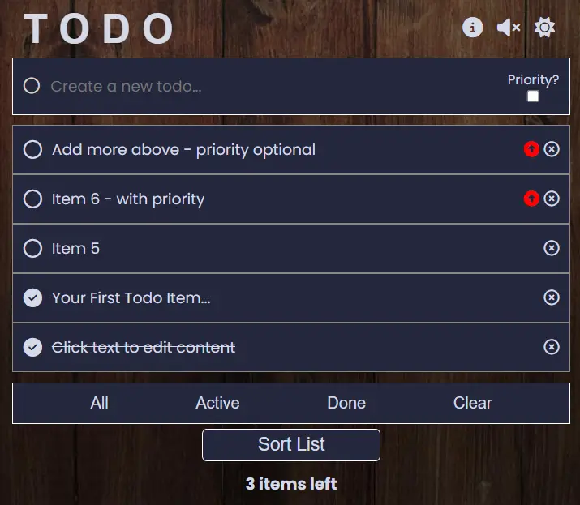

#### Optional Information Box

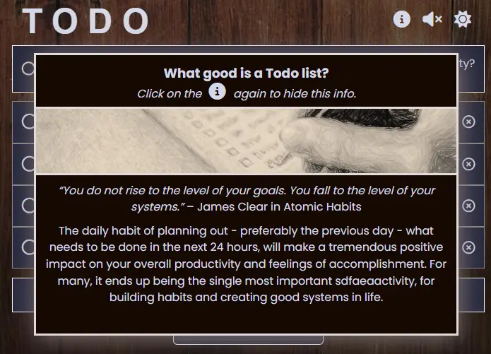

The optional information box is displayed when the user clicks on the ‘i’ button in the header. The box uses absolute positioning to not cover the header (since the user needs to deactivate the box with the same ‘i' button). The box is responsive and adjusts its colours based on the dark/light theme. The box image also updates depending on the theme. The box message contain a short motivation for users on the usefulness of a to do list.

#### Footer

The footer contains an external link to my GitHub profile and some copyright information. A small image with the logos of the technologies used in the app design is also centered in the footer. The footer uses absolute positioning and remains fixed to the bottom of the page.

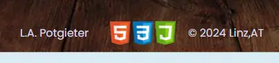

### Future Ideas

1.	Adding state permanence: Adding the ability for the currently entered data to remain in the app even when the app is refreshed.

2.	Adding JSON import and export: Making it possible for users to actually save their data to an external file, that is saved on their computer hard drives and can again be imported later. In this way, the app can be used long term without the need of a back-end database.

3.	Drag and Drop functionality: Allowing users to manually change the order of the to do list simply by dragging and dropping individual items to a new place in the list.

## Testing

The site was extensively tested using various screen sizes of different heights/widths to check for layout breakage. All internal links were checked to be working. Most of the testing revolved around validating text input when new items are entered, or existing items edited.

### Manual Testing

**- Testing Header & Footer**
| What will be Tested? | Expected Outcome | Test Procedure | Result |
|--|--|--|--|
|Header User Controls|The Toggle Theme button updates the colour palette on the entire site|Click on the toggle theme button|Pass|
|Header User Controls|The Sound Effect button enables and disables the app’s sound effect|Click on the sound effects button|Pass|
|Header User Controls|The Info box button hides/displays the information box|Click on the Info box button|Pass|
|Footer Link|The footer link opens the correct page in a new tab|Click on the Footer link|Pass|

 

**- Testing To do List Data Input & Display**
| What will be Tested? | Expected Outcome | Test Procedure | Result |
|--|--|--|--|
|Adding New Items Input Field|Users cannot enter invalid text for new items|Enter invalid text: Blank spaces and tabs| Pass |
|Adding New Items Input Field|Clicking the Priority box serves as input submit|Click the priority box with text present in input field| Pass |
|Adding New Items Input Field|As per above, but not with invalid (or non-existing) text|Click the priority box without text present in input field| Pass |
|Adding New Items Input Field|Pressing ‘Enter’ on new item text field serves as input submit|Press Enter in the text input field with valid text present| Pass |
|Adding New Items Input Field|As per above, but not with invalid (or non-existing) text|Press Enter in the text input field without valid text present| Pass |
|Adding New Items Input Field|Duplicate items are not allowed when adding new items|Enter Duplicate Item| Pass |
|Editing Existing Items|Users cannot enter invalid text when editing items|Enter invalid text: Blank spaces and tabs| Pass |
|Editing Existing Items|Duplicate items are not allowed when editing text of existing items|Enter Duplicate Item as new list text content| Pass |
|Remove Item Button|Users can always remove items from list|Click on Remove Item Icon| Pass |
|Check Items|Users are able to check items off their list|Click on Circle box to the left of item text| Pass |
|User Controls|Clicking ‘All’ shows all list items|Click on the ‘All’ button| Pass |
|User Controls|Clicking ‘Active’ only shows active list items|Click on the ‘Active’ button| Pass |
|User Controls|Clicking ‘Done’ only shows completed list items|Click on the ‘Done’ button| Pass |
|User Controls|Clicking ‘Clear’ allows users remove checked items from the list|Click on the ‘Clear’ button| Pass |
|User Controls|Clicking ‘Sort List’ allowed users to sort the to do list with priority items at the top and checked items at the bottom|Click on ‘Sort List’| Pass |
|User Controls|‘Sort List’ works when new items are added, items removed, checked, unchecked etc.|Click on ‘Sort List’| Pass |
|Items Left Check|The “items left” text update only when (1) items are checked, or (2) new items are added.|Review "Items left" number when list is in different states| Pass |

 

**- Testing for responsiveness**
| Test | Result |
|--|--|
|App displays correctly on screens between 320px & 479px |Pass|
|App displays correctly on screens between 480px & 767px |Pass|
|App displays correctly on screens between 768px & 1199px |Pass|
|App displays correctly on screens 1200px and larger |Pass|

 

**- Cross Browser Testing**
| Browser | Resolution | Result |
|--|--|--|
|Chrome|1200px|Very Good|
|Edge|1200px|Very Good|
|Firefox|1200px|Very Good|
|Safari|768px|Very Good|

### Validator Testing

- HTML | No errors were returned when passing through the official W3C validator. The results for index.html are below
  - [index.html HTML Validator Results](https://validator.w3.org/nu/?doc=https%3A%2F%2Fleonp84.github.io%2Fcode-institute-project-2%2F)

- CSS | No errors were returned when passing through the official W3C (Jigsaw) validator.
  - [style.css Jigsaw Validator Results](https://jigsaw.w3.org/css-validator/validator?uri=https%3A%2F%2Fleonp84.github.io%2Fcode-institute-project-2%2F&profile=css3svg&usermedium=all&warning=1&vextwarning=&lang=en)

- Javacscript | No errors were returned when passing the Javascript through the JSHint validation tool. Below a screenshot of the results.

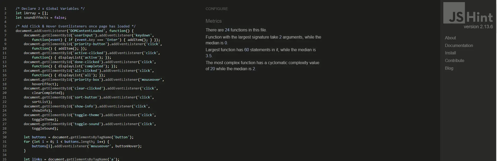

### Lighthouse Testing

The site was tested with Google Lighthouse using Chrome Developer Tools and the results for index.html are shown below.

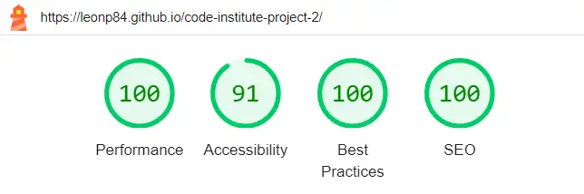

### Bugs

With the building and deployment of a more data intensive app such as an interactive to do list, squashing bugs formed a major part of the development journey. Some of the more prominent bugs encountered during testing are outlined below. All bugs have been fixed.

-	JSHint initially showed many, many warnings (over 300). The majority of these were missing semicolons, for instances where I did not properly assign variables. All were fixed
-	CSS Jigsaw validator identified wrong input text (`display: flex 1 auto`) and unused CSS properties which I previously implemented but was no longer used. They were removed and the display property updated to simply `display: flex`.

-	The HTML validator reported wrong `<id>` usage where I accidentally assigned the same `id`to multiple elements. I switched to using classes instead.

-	The ability to edit the text of an existing item proved the trickiest to implement. I initially tried using popup boxes (prompts) but wanted to avoid them and ended up allowing for in-line editing by using JavaScript to replace the existing text field with a transparent, borderless text input. This feature probably took the most debugging and testing to get right. Getting JavaScript to accept the new text item (of the recently created text field) took time to get right.

-	Getting the various user functions such as ‘Sort’ or ‘Clear’ to work required lots of debugging. This meant printing the main Array (on which the to do list items are based) to the console and going through the functions step by step to check where errors were creeping in.

-	The text input accepted any input, including black spaces. This was when I started implementing text validation as described above.

-	I later realised that editing the text of an existing item allowed users to bypass text validation, so had to implement the same validation process used for new items, also for existing items being edited.

-	The text input (still) accepts an input consisting of a continuous string of letters without spaces. This led to the text display in the to do list breaking the design, with the text bleeding out of bounds, into the background. For this the CSS `overflow: hidden`property was implemented.

-	The Hover functionality was initially implemented on all screen sizes which let to weird visual indicators when buttons were clicked on mobile. This was solved using a Media Query.

-	The Information Box popup initially was tied to the `<main>`tag which meant it covered the header when the screen vertical size was very long. To solve this I tied its positioning to the header itself, instead of to the `<main>`tag.

## Deployment

The site was deployed using GitHub pages and a live version is available for viewing. The GitHub repository contains a history of the commits made during development. To deploy the project I followed the below steps, starting from the project’s [main repository](https://github.com/leonp84/code-institute-project-2):

1.	I went to **Settings** on the navigation menu, at the top of the repository page.
2.	I then selected **Pages** menu on the left-hand side bar.
3.	In the first dropdown menu labelled **Source** I selected the branch called **Main** from the available options.
4.	In the next dropdown I left **/ root** as the default option.
5.	I clicked on Save.

After about 60 seconds after refreshing the GitHub Repository the site was shown (in the right-hand side bar) as deployed. Links are below.

### Links

Deployed Website: https://leonp84.github.io/code-institute-project-2/  
GitHub Repository: https://github.com/leonp84/code-institute-project-2

## Credits

### Content

-	General design and content inspired by the Todo App challenge on [Fontend Mentor]( https://www.frontendmentor.io/challenges/todo-app-Su1_KokOW).

-	The following fonts are provided by [Google Fonts]( https://fonts.google.com): "Poppins", "Quicksand", "Roboto".

-	Website Colour Palettes generated using [coolors.co](https://www.coolors.co).

- W3Schools proved an invaluable resource in helping with the following:  (1) [Array Sorting by Object Property]( https://www.scaler.com/topics/javascript-sort-an-array-of-objects/)  (2) [Using the Array.filter method](https://www.w3schools.com/jsref/jsref_filter.asp) (3) [Using Javascript to play HTML Audio]( https://www.w3schools.com/jsref/met_audio_play.asp)   (3) [Using CSS ‘overflow: hidden’ with ‘display: inline-block’](https://www.w3schools.com/css/css_overflow.asp)

- The tests and exercises at [JSCodeBox](https://jscodebox.com/) proved especially helpful in refining my Javascript skills for this project and helping me deal for Arrays and Objects.

### Media

-	Favicon icon and data Generated with [favicon.io](https://favicon.io/favicon-converter/).

-	A variety of in-text icons of index.html provided by [Font Awesome](https://www.fontawesome.com).

-	Background images were purchased and adapted from [Adobe Stock](https://stock.adobe.com/at/).

-	Image in the information box by [Glenn Carstens-Peters](https://unsplash.com/photos/person-writing-bucket-list-on-book-RLw-UC03Gwc) on Unsplash.

-	Sounds effects provided by [freesound.org](https://www.freesound.org).

