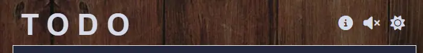

# SmokeStack Society

Welcome to the Readme file for TODO, a multi-functional online to do app using HTML, CSS & JavaScript.

**A note to the assessors:** *As per recommendation of my mentor I want to mention that I built the JavaScript part of this app in a previous repository to first check whether the project was feasible for my current skill level. With the development of this, final project some code from that previous built was then copied and pasted into this one. I mention that in case the short time frame between commits of (especially) the JavaScript part of this projects raise any red flags.*

**Link to Live Site: https://leonp84.github.io/code-institute-project-2/**
 
 

## Table of Contents

… TOC Here …

## Overview

TODO is a simple, but multifunctional to do web-based application that allows users to create a basic to do list that is fully editable, sortable, and can be filtered according to task status. The app incorporates a visually appealing design that is minimalistic and has built in light/dark functionality which the user can toggle. Optional sound effects and a help toggle rounds out the app’s offerings.

The app is fully responsive across all screen sizes, with break points for layout adjustment at 375px, 530px & 769px. The app looks most visually appealing in cell phone and tablet (portrait) format.

## UX

### User Stories

The sentences below outline possible motivations of *potential users* visiting the site. Goals of myself as site administrator is also added.

#### User

> Potential User: *A busy professional* / "I need a no-fuss tool for managing my daily tasks. A tool with simple functionality that can be grasped without training or reading documentation."

> Potential User: *A parent* / "I want to set daily tasks as reminders of activities involving my spouse or children. I need something that isn’t complicated or picky to use.”

> Potential User: *A Freelancer* / "I want a tool that allows me to not only set goals, but prioritise certain goals above others, and make it visually obvious which these prioritised goals are."

> Potential User: *A Remote Worker* / "Working from home, I have many items to keep track of, and need a tool that can automatically sort my tasks, based on status, by the click of a button."

#### Site Administrator

> As the site administrator, I want to help visitors with managing their daily tasks in a intuitive and distraction free environment.

> As the site administrator, I want visitors to increase their productivity by incorporating habits of daily planning and scheduling into their workflow.

> As the site administrator, I want to users to be interested in other potential (paid) features the app might introduce in the future.

> As the site administrator, I want to make it as frictionless as possible for customers to sign up for any possible future offerings.

### Site Concept

As a for-profit business, I wanted the TODO online web app to serve the potential visitors by providing basic a productivity tool to boost efficiency without unnecessary extras. The User experience had to therefore fulfil the following goals:

1. Be visually simple and minimalistic – essentially distraction-free.
2. Provide appealing, but unobtrusive visual design that makes the app a pleasure to use.
3. Provide clear and unambiguous information about which interactive elements of the app provide which functionality.
4. Provide the functionality of sorting, filtering, reordering and clearing items from the users to do list.
5. Provide an optional information box with a short motivational text on the value of a to do list.

### Wireframing

After the site concept was finalised, time was taken to create a wireframe mock-up of the app. The app consists of a single landing page with hidden visual elements (an information box) that the user can toggle. Wireframing was done with [Balsamiq](https://balsamiq.com/) software.

#### Desktop

#### Mobile

### Site Design

To aid in providing an unambiguous and distraction free experience for visitors, a colour palette was used to keep the design consistent across the different pages on the site. The Colour palette is shown below, for both the dark and light modes of the app. Most of the app pictures that follow in the rest of this document were taken with the app dark theme being activated.

**Site Colour Palette Light Mode**

**Site Colour Palette Light Mode**

## Features

The site consists of a single landing page. The specific features of the to do app itself is discussed in detail below.

### Existing Features

#### Site Logo

In keeping with the app’s minimalistic design, the site logo simply consists of the letters “T O D O” written out in a large Roboto Font.

#### Header

With the logo positioned left, the right-hand side of the header includes three buttons: (1) An information box activation toggle, (2) A sound effects toggle and, (3) A dark/light theme toggle. The Header is fully responsive, and the heading font colours adjust with the rest of the site when the visual theme is changed by the user.

The two right most buttons dynamically update when clicked, to indicate to the user that a feature has been activated/deactivated. 

**Site Header Button Not Activated** 

**Site Header Button  Activated** 

With the sound toggle on, five sound effects are played – depending on the browser and user environment -when users perform the following actions (These functionalities are explained in more detail below): (1) add new items, (2) check an item (3) click on ‘All’, ‘Active’ or ‘Done’, (4) click on ‘Clear’, and (5) click on ‘Sort List’

**Dark Theme activated:**

**Light Theme activated:**

#### Add New User Item

Below the header, the main user input is presented. Here the user can enter a new to do item which will be added to their main list. Next to the text field an additional “Priority?” checkbox is provided, which users can tick to assign the task with additional priority (which is indicated in the list display).

**Features of the user input field:**

1. Accepts ‘Enter’ as valid form submission. 
2. Accepts the click of the Priority button also as valid form submission (only if valid text is present in the text field). 
3. Does not accept black spaces or tabs as valid input. 
4. After each iteration where the new list is displayed (or other features of the app engaged in) focus is placed back on the user input field, and the field is emptied of any previous text. This avoids the user needing to constantly re-click on the text box.

#### Main List Display

Each task is listed in the order they were entered, with priority tasks additionally having a small red arrow next to them. Features of this section:

(1)	Once a task is finished, users can check the box next to it and the visual display of the task updates. The checkbox now remains checked, and the text is presented with the line-through text decoration to indicate the task is done. Items can be unchecked, if the user so desires.
(2)	Each task can be clicked on, and the text automatically turns into an input field, with the current text now editable. Users can change the text and press ‘Enter’ to save the new wording. The edited items remain in place. 
(3)	Users can completely remove tasks from the list by clicking the ‘X’ to the right of each displayed item.
(4)	On larger screens, the item text and remove buttons includes a hover effect for visual feedback.

#### User Controls

Under the displayed list, a section with user controls is presented. Features of this section.

1. Clicking ‘All’ display the entire list, irrespective of items status.
2. Clicking ‘Active’ displays items that have not been checked (and has a line-through text).
3. Clicking ‘Done’ displays items that the user have checked as completed.

4. Clicking ‘Clear’ completely removes all checked items from the list with only active tasks remaining. The user can use this button to minify the list if desired.
5. Clicking ‘Sort’ will sort the list in place, with priority items placed at the top, and checked (completed) items at the bottom (Image Below).
6. The items left are displayed at the bottom of the sort button. This number dynamically updates as users check/uncheck an item or adds new ones to the list.
7. On larger screens, the user control buttons include a hover effect for visual feedback.

**Main To do list after the user has clicked on the ‘Sort’ button**

#### Optional Information Box

The optional information box is displayed when the user clicks on the ‘i’ button. The box uses absolute positioning to not cover the header (since the user needs to deactivate the box with the same ‘i' button). The box is responsive and adjusts its colours based on the dark/light theme. The box image also updates depending on the theme. The box contents contain a short motivation for users on the usefulness of a to do list.

#### Footer

The footer contains external link to my GitHub profile and some copyright information. A small image with the logos of the technologies used in the app design is also centered in the footer. The footer uses absolute positioning and remains fixed to the bottom of the page.

### Future Ideas

1.	Adding state permanence: Adding the ability for the currently entered data to remain in the app even when the app is refreshed.
2.	Adding JSON import and export: Making it possible for users to actually save their data to an external file, that is saved on their computer hard drives and can again be imported later. In this way, the app can be used long term without the need of a back-end database.
3.	Drag and Drop functionality: Allowing users to manually change the order of the to do list simply by dragging and dropping individual items to a new place in the list.

## Testing

The site was extensively tested using various screen sizes of different heights/widths to check for layout breakage. All internal and external links were checked to be working. Details below:

### Manual Testing

**- Testing Links and Navigation**
| What will be Tested? | Expected Outcome | Test Procedure | Result |
|--|--|--|--|
|Navigation links on all three pages|The Links lead to the correct pages|Click on each link on every page|Pass|
|Site logo in header|The Logo leads to the Home Page in all locations where present|Click on every instance of the logo|Pass|
|Sign up Button on both pages, where present|The Buttons lead to the sign up page|Click on every instance of the signup button|Pass|
|Footer social links|The Links all lead to their respective social media sites (new tab)|Click on all footer links on every page|Pass|

**- Testing Sign up Form**
| What will be Tested? | Expected Outcome | Test Procedure | Result |
|--|--|--|--|
|First Name field| Only accepts correct input type | Enter Erroneous Data (Blank, Numbers, Single Letter, Special Character) | Pass |
|Last Name field |Only accepts correct input type | Enter Erroneous Data (Blank, Numbers, Single Letter, Special Character)  | Pass |
|Email field | Only accepts correct input type |Enter Erroneous Data (Blank, Numbers, Single Letter, No @ sign) | Pass |
|Submit Button | Sign up form submits information to correct location | Submit Dummy Form | Pass |

**- Testing for responsiveness**
| Test | Result |
|--|--|
|Landing, Sign up & Testimonial pages displays correctly on screens between 320px & 479px |Pass|
|Landing, Sign up & Testimonial pages displays correctly on screens between 480px & 767px |Pass|
|Landing, Sign up & Testimonial pages displays correctly on screens between 768px & 1199px |Pass|
|Landing, Sign up & Testimonial pages displays correctly on screens 1200px and larger |Pass|

**- Cross Browser Testing**
| Browser | Resolution | Result |
|--|--|--|
|Chrome|1200px|Very Good|
|Edge|1200px|Very Good|
|Firefox|1200px|Very Good|
|Safari|768px|Very Good|

### Validator Testing

- HTML
No errors were returned when passing through the official W3C validator. The results for index.html are below
  - [index.html HTML Validator Results](https://validator.w3.org/nu/?doc=https%3A%2F%2Fleonp84.github.io%2Fcode-institute-project-2%2F)

- CSS
No errors were returned when passing through the official W3C (Jigsaw) validator.
  - [style.css Jigsaw Validator Results](https://jigsaw.w3.org/css-validator/validator?uri=https%3A%2F%2Fleonp84.github.io%2Fcode-institute-project-2%2F&profile=css3svg&usermedium=all&warning=1&vextwarning=&lang=en)

- Javacscript
No errors were returned when passing through the JSHint JavaScript validation tool. Below a screenshot of the results.

### Lighthouse Testing

The site was tested with Google Lighthouse using Chrome Developer Tools and the results for index.html are shown below.

### Bugs

With the building and deployment of a more data intensive app such as an interactive to do list, squashing bugs formed a major part of the development journey. Some of the more prominent bugs encountered during testing are outlined below. All bugs have been fixed.

- Xx

- Xx

- Xx

## Deployment

The site was deployed using GitHub pages and a live version is available for viewing. The GitHub repository contains a history of the commits made during development. To deploy the project I followed the below steps, starting from the project’s [main repository](https://github.com/leonp84/code-institute-project-2):

1.	I went to **Settings** on the navigation menu, at the top of the repository page.
2.	I then selected **Pages** menu on the left-hand side bar.
3.	In the first dropdown menu labelled **Source** I selected the branch called **Main** from the available options.
4.	In the next dropdown I left **/ root** as the default option.
5.	I clicked on Save.

After about 60 seconds after refreshing the GitHub Repository the site was shown (in the right-hand side bar) as deployed. Links are below.

### Links

Deployed Website: https://leonp84.github.io/code-institute-project-2/  
GitHub Repository: https://github.com/leonp84/code-institute-project-2

## Credits

### Content

-	General design and content inspired by the Todo App challenge on [Fontend Mentor]( https://www.frontendmentor.io/challenges/todo-app-Su1_KokOW) from Code Institute.
-	The following fonts are provided by [Google Fonts]( https://fonts.google.com): "Poppins", "Quicksand", "Roboto"
-	Website Colour Palettes generated using [coolors.co](https://www.coolors.co)
- W3Schools proved an invaluable resource in helping with the following:  (1) [Array Sorting by Object Property]( https://www.scaler.com/topics/javascript-sort-an-array-of-objects/)  (2) [Using the Array.filter method](https://www.w3schools.com/jsref/jsref_filter.asp) (3) [Using Javascript to play HTML Audio]( https://www.w3schools.com/jsref/met_audio_play.asp)   (3) [Using CSS ‘overflow: hidden’ with ‘display: inline-block’](https://www.w3schools.com/css/css_overflow.asp)

### Media

-	Favicon icon and data Generated with [favicon.io](https://favicon.io/favicon-converter/)
-	A variety of in-text icons of index.html provided by [Font Awesome](https://www.fontawesome.com)
-	Background images in were purchased and adapted from [Adobe Stock](https://stock.adobe.com/at/)
-	Image in the information box by [Glenn Carstens-Peters](https://unsplash.com/photos/person-writing-bucket-list-on-book-RLw-UC03Gwc) on Unsplash.
-	Sounds effects provided for free by [freesound.org](https://www.freesound.org)

